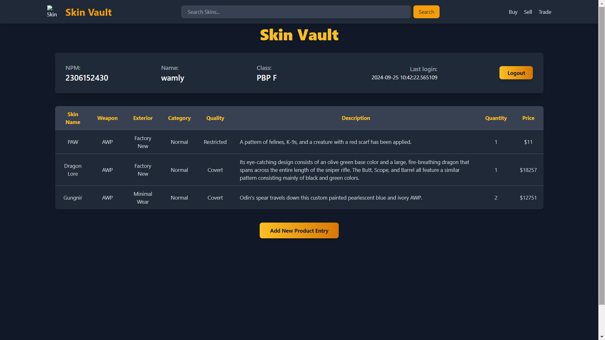
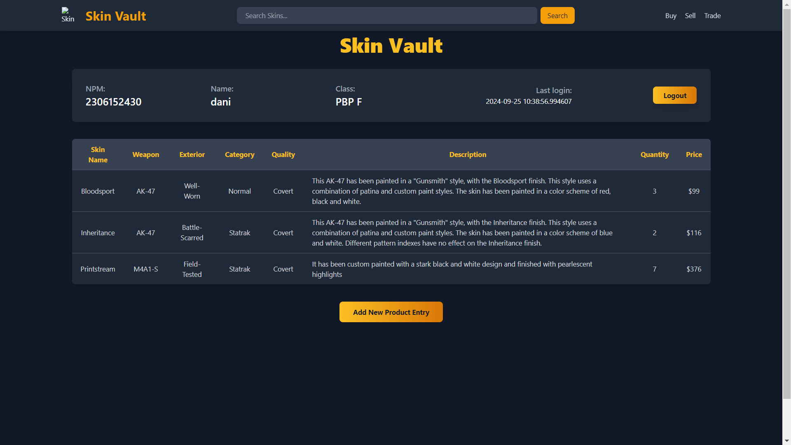
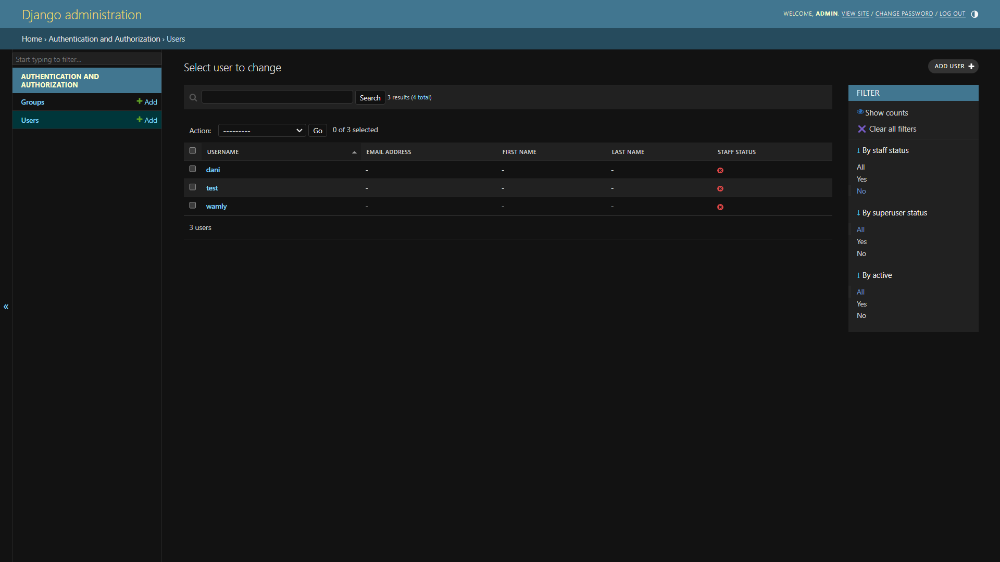
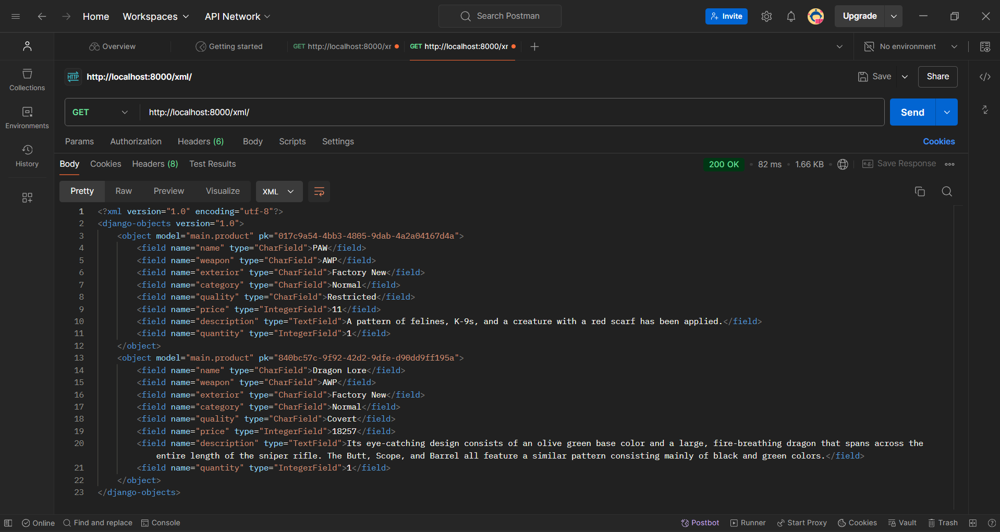
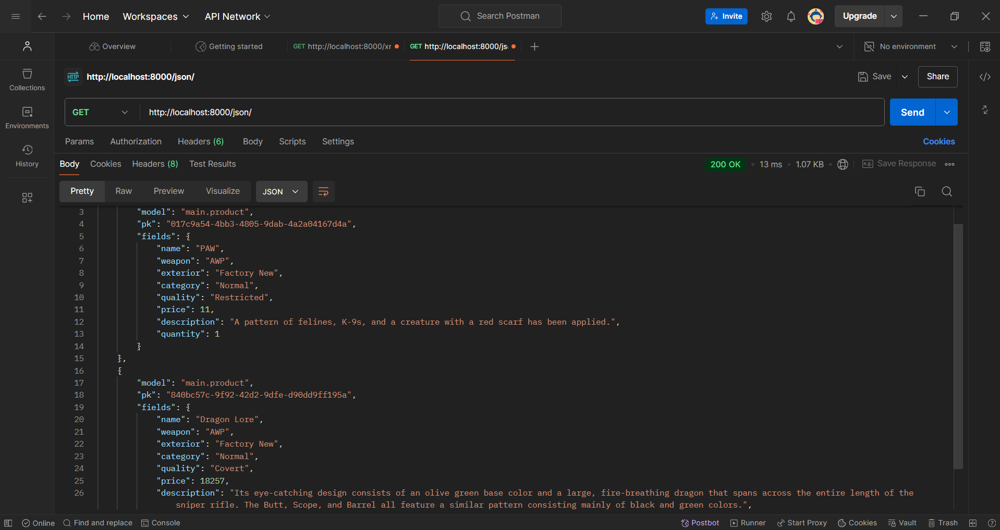
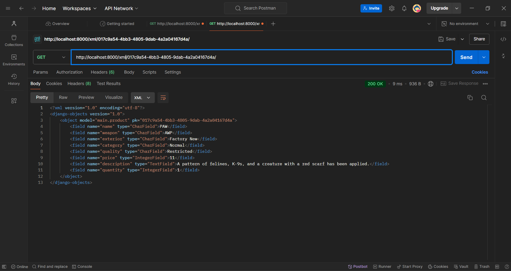
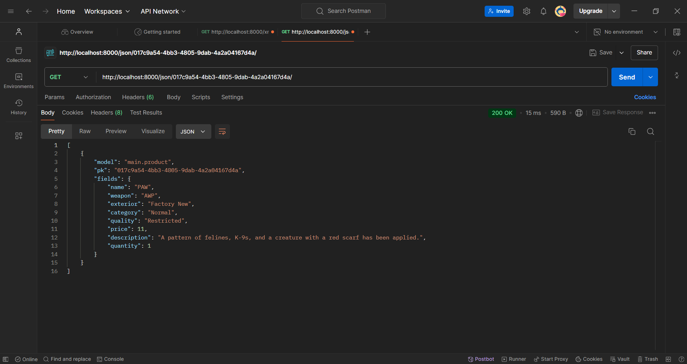
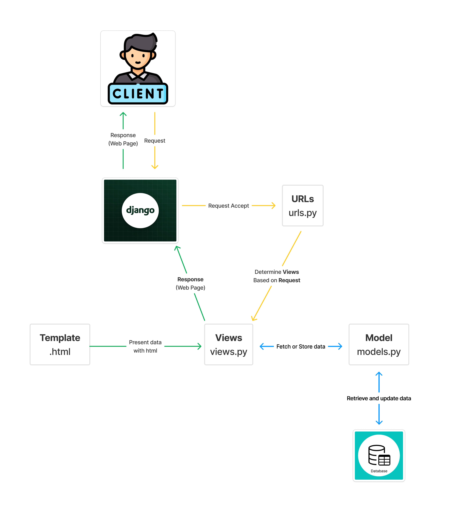

# Skin Vault 
**Nama:**   Malvin Scafi<br>
**NPM:**    2306152430<br>
**Kelas:**  PBP F<br>

Hasil proyek dapat dilihat pada [link berikut](http://malvin-scafi-skinvault.pbp.cs.ui.ac.id/).

## Tugas 4
### 1. Apa perbedaan antara `HttpResponseRedirect()` dan `redirect()`
`HttpResponseRedirect()` dan `redirect()` adalah dua cara untuk mengalihkan pengguna ke URL lain dalam aplikasi Django, tetapi ada beberapa perbedaan antara keduanya:
#### A. HttpResponseRedirect():
Ini adalah kelas yang secara langsung membuat respons pengalihan HTTP (HTTP 302) dan harus memberikan URL tujuan sebagai argumen.
Contoh Penggunaanya:
```python
from django.http import HttpResponseRedirect

def my_view(request):
    return HttpResponseRedirect('/some-url/')
```
#### B. redirect():
Ini adalah fungsi pembantu yang lebih fleksibel dan lebih tinggi tingkatannya. Dapat memberikan URL sebagai string, tetapi juga dapat memberikan nama view atau objek model. Fungsi ini akan mengelola pengalihan berdasarkan argumen yang diberikan.
Contoh Penggunaaannya:
```python
from django.shortcuts import redirect

def my_view(request):
    return redirect('some-view-name')
```
`redirect()` secara otomatis menangani URL yang dihasilkan dari nama view dan dapat juga menangani argumen tambahan jika diperlukan.

#### Secara umum, `redirect()` lebih umum digunakan karena kemudahannya dan dukungan untuk pengalihan berdasarkan nama view.

### 2. Jelaskan cara kerja penghubungan model `Product` dengan `User`!
Terdapat proses penghubungan antara model `Product` di aplikasi `main` dengan data `User`, yang ditambahkan sebagai field baru dalam `Product`. Dengan adanya koneksi ini, setiap `Product` kini terkait dengan seorang `User` di database. Penghubungan tersebut dilakukan melalui penambahan field `user` yang berfungsi sebagai Foreign Key ke model `User` pada model `Product`.
```python
from django.contrib.auth.models import User

class Product(models.Model): 
    # Atribut lainnya...
    user = models.ForeignKey(User, on_delete=models.CASCADE)
    # Atribut lainnya...
```
Dari kode di atas, field `user` ditambahkan ke dalam model `Product` sebagai sebuah Foreign Key yang mengacu ke model `User`, sehingga setiap produk di database akan terhubung dengan pemiliknya. Foreign Key ini membuat hubungan many-to-one, artinya setiap produk hanya dimiliki oleh satu pengguna, namun satu pengguna bisa memiliki banyak produk.

Selain itu, terdapat parameter `on_delete` dengan nilai `models.CASCADE` dalam Foreign Key tersebut. Pengaturan ini memastikan bahwa jika seorang `user` dihapus dari database, semua produk yang dimiliki oleh `user` tersebut juga akan ikut terhapus. Hal ini mencegah adanya entri produk yang tidak memiliki pemilik di dalam database.

### 3. Apa perbedaan antara authentication dan authorization, apakah yang dilakukan saat pengguna login? Jelaskan bagaimana Django mengimplementasikan kedua konsep tersebut.
- ***Authentication***

Authentication adalah proses verifikasi identitas user untuk memastikan mereka adalah yang mereka klaim. Biasanya, Authentication dilakukan dengan meminta username dan password. Dalam Django, setelah user mencoba login, kredensial mereka diperiksa. Jika valid, Django membuat session yang mengaitkan user dengan identitasnya.

Di project ini, Authentication menggunakan sistem bawaan Django melalui fungsi `login_user()` di `views.py` yang berisi :
```python
def login_user(request):
    if request.method == 'POST':
        form = AuthenticationForm(data=request.POST)

        if form.is_valid():
            user = form.get_user()
            login(request, user)
            response = HttpResponseRedirect(reverse("main:show_main"))
            response.set_cookie('last_login', str(datetime.datetime.now()))
            return response
    else:
        form = AuthenticationForm(request)
    context = {'form': form}
    return render(request, 'login.html', context)
```
Django menggunakan `AuthenticationForm()` untuk autentikasi login user. Form ini dapat ditampilkan otomatis di template HTML dengan `{{ form.as_table }}`. Setelah login berhasil, Django membuat entri session di database dan mengaitkannya dengan ID user yang terautentikasi, menggunakan middleware session.

- ***Authorization***
Authorization adalah proses verifikasi hak akses user terhadap sumber daya atau tindakan tertentu setelah mereka terautentikasi. Django menentukan aktivitas yang diizinkan untuk user, misalnya admin bisa mengakses dashboard, sementara user biasa hanya dapat melihat profilnya.

Dalam project ini, authorization diterapkan saat user ingin mengakses halaman utama, menggunakan decorator `@login_required(login_url='/login')`, yang mengarahkan user yang belum login untuk masuk terlebih dahulu. Contoh implementasinya:
```python
@login_required(login_url='/login')
def show_main(request):
    product_entries = Product.objects.filter(user=request.user)
    ...
```
Selain `@login_required`, Django juga menyediakan decorator lain seperti `@permission_required` untuk mengelola otorisasi.


### 4. Bagaimana Django mengingat pengguna yang telah login? Jelaskan kegunaan lain dari cookies dan apakah semua cookies aman digunakan?
Cookies dalam Django digunakan untuk mengelola sesi dan menyimpan data pengguna setelah login, memungkinkan server untuk mengenali pengguna tanpa memerlukan login berulang. Selain itu, cookies bisa digunakan untuk menyimpan preferensi pengguna, personalisasi iklan, dan autentikasi berkelanjutan ("Remember Me").

Namun, tidak semua cookies aman. Pengelolaan cookies yang buruk dapat menimbulkan risiko seperti:
- Cross-Site Scripting (XSS) & Session Hijacking: Penyerang dapat mencuri session ID dan mengambil alih sesi pengguna.
- Cross-Site Request Forgery (CSRF): Penyerang dapat memanfaatkan session cookie untuk membuat pengguna melakukan tindakan tidak diinginkan tanpa sepengetahuan mereka.
- Privasi & Pelacakan: Persistent cookies dapat melacak aktivitas pengguna, mengancam privasi mereka, terutama untuk iklan yang terlalu agresif.

Django menawarkan perlindungan seperti parameter `HttpOnly`, `Secure`, dan `SameSite` untuk mencegah akses tidak sah dan menjaga keamanan cookies.


### 5. Jelaskan bagaimana cara kamu mengimplementasikan checklist di atas secara step-by-step (bukan hanya sekadar mengikuti tutorial).
**A. Implementasi registrasi, login, dan logout**

Implementasi fitur registrasi dan login dalam proyek ini dapat dilakukan dengan memanfaatkan form bawaan Django, yaitu *UserCreationForm* untuk registrasi dan *AuthenticationForm* untuk login. Berikut adalah langkah-langkah implementasinya:
1. Registrasi
- Views Registrasi: Menggunakan *UserCreationForm* untuk membuat akun baru. Jika form valid, akun disimpan dan pesan sukses ditampilkan. Pengguna akan diarahkan ke halaman login.
- Template: Halaman HTML `register.html` menampilkan form pendaftaran.
```python
def register(request):
    form = UserCreationForm()

    if request.method == "POST":
        form = UserCreationForm(request.POST)
        if form.is_valid():
            form.save()
            messages.success(request, 'Your account has been successfully created!')
            return redirect('main:login')
    
    return render(request, 'register.html', {'form': form})
```
2. Login
- Views Login: Menggunakan *AuthenticationForm* untuk otentikasi. Jika valid, pengguna akan login, dan waktu login terakhir disimpan di *Cookies*.
- Template: Halaman `login.html` menampilkan form login.
```python
def login_user(request):
    if request.method == 'POST':
        form = AuthenticationForm(data=request.POST)
        if form.is_valid():
            user = form.get_user()
            login(request, user)
            response = HttpResponseRedirect(reverse("main:show_main"))
            response.set_cookie('last_login', str(datetime.datetime.now()))
            return response

    return render(request, 'login.html', {'form': AuthenticationForm(request)})
```
3. Logout
- Views Logout: Memanggil fungsi *logout()* untuk keluar, sekaligus menghapus *Cookies* login terakhir.
```python
def logout_user(request):
    logout(request)
    response = HttpResponseRedirect(reverse('main:login'))
    response.delete_cookie('last_login')
    return response
```
4. URLs
Pastikan semua views di atas terdaftar di `urls.py`:
```python
urlpatterns = [
    path('register/', register, name='register'),
    path('login/', login_user, name='login'),
    path('logout/', logout_user, name='logout'),
]
```
**B. Dua Akun Dummy Dengan Masing-Masing 3 Product**
- Akun Wamly

- Akun Dani

Bukti akun di sistem admin Django


**C. Menghubungkan model `Product` dengan `User`**
Untuk menghubungkan model `Product` dengan `User`, kita perlu menambahkan atribut baru yang berisi *ForeignKey* ke model `User`, sehingga terbentuk relasi antara kedua model tersebut. Atribut ini dapat dibuat menggunakan `models.ForeignKey()` dengan referensi ke model `User`.
```python
from django.contrib.auth.models import User

class Product(models.Model):
    ...
    user = models.ForeignKey(User, on_delete=models.CASCADE)
    ...
```
Setelah menambahkan atribut user, update database untuk menambahkan kolom baru dengan menjalankan perintah berikut:
```python
python manage.py makemigrations
python manage.py migrate
```


## Tugas 3
### 1. Jelaskan mengapa kita memerlukan data delivery dalam pengimplementasian sebuah platform?
Sistem data delivery yang efisien dan aman sangat penting dalam implementasi platform untuk mengirim dan menerima data antara client dan server. Dengan menggunakan format seperti XML atau JSON, data dapat ditransfer secara cepat dan dinamis, memungkinkan platform web yang lebih responsif, misalnya melalui penggunaan teknologi AJAX. Ini memungkinkan konten halaman web diperbarui tanpa harus memuat ulang, meningkatkan pengalaman pengguna (UX) dan performa aplikasi secara keseluruhan.

Data delivery juga berperan dalam menjaga sinkronisasi data antar perangkat dan memastikan bahwa data dapat diakses secara real-time. Dengan sistem yang baik, platform dapat mengolah permintaan data secara efisien, meningkatkan interaktivitas dan responsivitas dari sisi pengguna. Selain itu, keamanan dan integritas data tetap terjaga selama proses transfer, menghindari risiko pencurian data melalui proteksi yang memadai di setiap tahap pertukaran data.

### 2. Menurutmu, mana yang lebih baik antara XML dan JSON? Mengapa JSON lebih populer dibandingkan XML?
Menurut saya, JSON *(JavaScript Object Notation)* cenderung lebih unggul dibandingkan XML *(Extensible Markup Language)* dalam banyak kasus, terutama untuk pertukaran data di aplikasi web. JSON lebih sederhana, ringkas, dan mudah dibaca, baik oleh manusia maupun mesin, karena tidak memerlukan tag pembuka dan penutup yang rumit seperti pada XML. Selain itu, proses parsing JSON lebih cepat di hampir semua bahasa pemrograman, terutama dalam JavaScript, yang merupakan fondasi banyak aplikasi web modern. JSON juga lebih mudah diintegrasikan dengan API dan teknologi web saat ini, sehingga membuatnya lebih populer di kalangan pengembang.

Meskipun XML masih memiliki keunggulan dalam hal struktur dokumen yang lebih kompleks dan fleksibilitas untuk representasi hierarkis, JSON lebih cocok untuk aplikasi yang berorientasi objek dan pertukaran data yang cepat dan efisien. Dukungan yang luas dari teknologi modern seperti RESTful API dan kebutuhan akan format data yang lebih ringan menjadikan JSON sebagai pilihan yang lebih umum di aplikasi web dan mobile. Pada akhirnya, kesederhanaan dan kemudahan penggunaan JSON menjadikannya lebih disukai dibandingkan XML dalam banyak skenario pengembangan modern.

### 3. Jelaskan fungsi dari method is_valid() pada form Django dan mengapa kita membutuhkan method tersebut?
Method `is_valid()` pada form Django digunakan untuk memvalidasi data yang diinputkan oleh pengguna. Fungsinya adalah memastikan bahwa data tersebut memenuhi aturan validasi yang telah ditentukan, seperti tipe data yang benar atau panjang karakter yang sesuai. Jika valid, method ini akan mengembalikan `True` dan mengisi atribut `cleaned_data` dengan data yang telah dibersihkan, siap digunakan dalam aplikasi. Method ini sangat penting untuk mencegah data yang tidak valid masuk ke dalam sistem, menjaga keamanan, dan memastikan bahwa hanya data yang valid diproses lebih lanjut.

### 4. Mengapa kita membutuhkan csrf_token saat membuat form di Django? Apa yang dapat terjadi jika kita tidak menambahkan csrf_token pada form Django? Bagaimana hal tersebut dapat dimanfaatkan oleh penyerang?
`csrf_token` diperlukan di Django untuk melindungi aplikasi dari serangan CSRF *(Cross-Site Request Forgery)*, di mana penyerang memanfaatkan sesi aktif pengguna untuk mengirim permintaan berbahaya tanpa sepengetahuan pengguna. `csrf_token` adalah token unik yang dimasukkan ke dalam form untuk memverifikasi bahwa permintaan berasal dari halaman yang sah.

Jika form tidak dilindungi oleh `csrf_token`, penyerang bisa mengirim permintaan palsu atas nama pengguna, misalnya mengubah data atau melakukan transaksi tanpa otorisasi. Dengan menambahkan `csrf_token`, aplikasi terlindung dari eksploitasi semacam ini.

### 5. Jelaskan bagaimana cara kamu mengimplementasikan checklist di atas secara step-by-step (bukan hanya sekadar mengikuti tutorial).
1. Membuat `form` input di dalam file `forms.py` untuk menambahkan produk baru di aplikasi `.
````python
class ProductForm(ModelForm):
    class Meta:
        model = Product
        fields = ["name", "weapon", "exterior","category","quality","price","description","quantity"]
```
Form akan ditampilkan sebagai HTML yang ada pada templates `create_product_entry.html`. Setelah itu HTML tersebut akan diproses dan dikembalikan ke user melewati fungsi `create_product_entry()` yang ada dalam `views.py`
```python
def create_product_entry(request):
    form = ProductForm(request.POST or None)

    if form.is_valid() and request.method == "POST":
        form.save()
        return redirect('main:show_main')

    context = {'form': form}
    return render(request, "create_product_entry.html", context)
```
2. Menambahkan 4 fungsi baru di `views.py` untuk menampilkan produk yang telah ditambahkan dalam berbagai format dan opsi, yakni:
```python
# Show all product in XML
def show_xml(request):
    data = Product.objects.all()
    return HttpResponse(serializers.serialize("xml", data), content_type="application/xml")

# Show all product in JSON
def show_json(request):
    data = Product.objects.all()
    return HttpResponse(serializers.serialize("json", data), content_type="application/json")

# Show all product in XML based on ID
def show_xml_by_id(request, id):
    data = Product.objects.filter(pk=id)
    return HttpResponse(serializers.serialize("xml", data), content_type="application/xml")

# Show all product in JSON based on ID
def show_json_by_id(request, id):
    data = Product.objects.filter(pk=id)
    return HttpResponse(serializers.serialize("json", data), content_type="application/json")
```
3. Menambahkan URL routing untuk setiap view baru di file `main/urls.py` agar bisa diakses.
```python
...
    path('create-product-entry', create_product_entry, name='create_product_entry'),
    path('xml/', show_xml, name='show_xml'),
    path('json/', show_json, name='show_json'),
    path('xml/<str:id>/', show_xml_by_id, name='show_xml_by_id'),
    path('json/<str:id>/', show_json_by_id, name='show_json_by_id'),
...
```
4. Melakukan `add - commit - push` ke GitHub dan PWS.

### 6. Mengakses keempat URL di poin 2 menggunakan Postman, membuat screenshot dari hasil akses URL pada Postman
1. All Products in XML

2. All Products in JSON

3. Product XML By ID

4. Product JSON By ID



## Tugas 2
### 1. Jelaskan bagaimana cara kamu mengimplementasikan checklist di atas secara step-by-step (bukan hanya sekadar mengikuti tutorial).
1. Membuat repositori lokal baru, lalu membuat repositori di GitHub dan dihubungkan menggunakan `git remote add origin https://github.com/Cyades/os242.git`.
2. Menambahkan .gitignore untuk mengabaikan file yang tidak diperlukan, dan README.md untuk menjawab pertanyaan tugas proyek.
3. Membuat proyek Django dengan `django-admin startproject skin-vault` . dan mencatat dependensi di `requirements.txt`.
4. Membuat aplikasi bernama `main` dengan perintah `python manage.py startapp main`.
5. Memodifikasi `models.py` di aplikasi `main` untuk membuat model baru yang mendefinisikan struktur data yang akan disimpan di database yaitu:
```Python
class Product(models.Model):
    name = CharField,
    weapon = CharField,
    exterior = CharField,
    category = CharField,
    quality = CharField,
    price = IntegerField,
    description = TextField,
    quantity = IntegerField,

    @property
    def is_product_available(self):
        return self.quantity > 0
```
6. Menyimpan model tersebut dan menjalankan perintah `python manage.py makemigrations` serta `python manage.py migrate` untuk menerapkan model yang baru saya buat.
7. Membuat file baru bernama `main.html` di dalam direktori `main/templates`, kemudian menambahkan view baru yang disebut `show_main()` untuk menampilkan template tersebut dengan menyertakan context berupa identitas diri saya sendiri.
8. Selanjutnya, saya mengatur routing dengan membuat file `urls.py` di folder `main`, lalu membuat suatu pola URL yang akan memanggil fungsi yang telah dibuat di `views.py`. Agar aplikasi `main` terhubung dengan proyek utama, saya juga mengatur file `urls.py` di direktori proyek utama dan menambahkan pola URL yang mengarahkan ke pola URL yang sudah dibuat sebelumnya.
9. Melakukan deployment ke GitHub dan Pacil Web Service.

### 2. Buatlah bagan yang berisi request client ke web aplikasi berbasis Django beserta responnya dan jelaskan pada bagan tersebut kaitan antara urls.py, views.py, models.py, dan berkas html.


### 3. Jelaskan fungsi git dalam pengembangan perangkat lunak!
Git adalah sistem kontrol versi yang digunakan dalam pengembangan perangkat lunak untuk:
1. Pelacakan perubahan: Mencatat setiap perubahan pada kode sumber.
2. Kolaborasi: Memungkinkan banyak pengembang bekerja secara bersamaan tanpa mengganggu satu sama lain.
3. Branching: Mengembangkan fitur baru atau memperbaiki bug di cabang terpisah dari kode utama.
4. Reversi perubahan: Mengembalikan perubahan yang salah dengan mudah.
5. Manajemen rilis: Mengelola versi perangkat lunak untuk rilis stabil dan beta.
Dengan Git, pengembangan perangkat lunak menjadi lebih efisien dan terstruktur.

### 4. Menurut Anda, dari semua framework yang ada, mengapa framework Django dijadikan permulaan pembelajaran pengembangan perangkat lunak?
Menurut saya, Django dijadikan pilihan untuk pembelajaran pengembangan perangkat lunak karena mudah dipelajari, memiliki dokumentasi yang baik, dan pendekatan "batteries included" yang menyediakan banyak fitur bawaan seperti autentikasi dan manajemen basis data. Dengan arsitektur Model-View-Template (MVT) dan ORM yang sederhana, Django memudahkan pemahaman konsep pengembangan web serta hubungan antara model dan basis data. Framework ini juga sangat aman, skalabel, didukung oleh komunitas besar, dan digunakan dalam proyek nyata, sehingga cocok bagi pemula (seperti saya) yang ingin mempelajari dasar-dasar hingga pengembangan aplikasi skala besar.

### 5. Mengapa model pada Django disebut sebagai ORM?
Dalam Django, model disebut sebagai ORM (Object-Relational Mapping) karena mereka menyediakan cara untuk berinteraksi dengan basis data menggunakan objek Python, bukan menggunakan query SQL langsung. ORM adalah sebuah teknik pemrograman yang memungkinkan pengembang untuk bekerja dengan basis data dengan menggunakan objek dan metode yang sesuai dengan struktur basis data, alih-alih menulis query SQL secara manual.